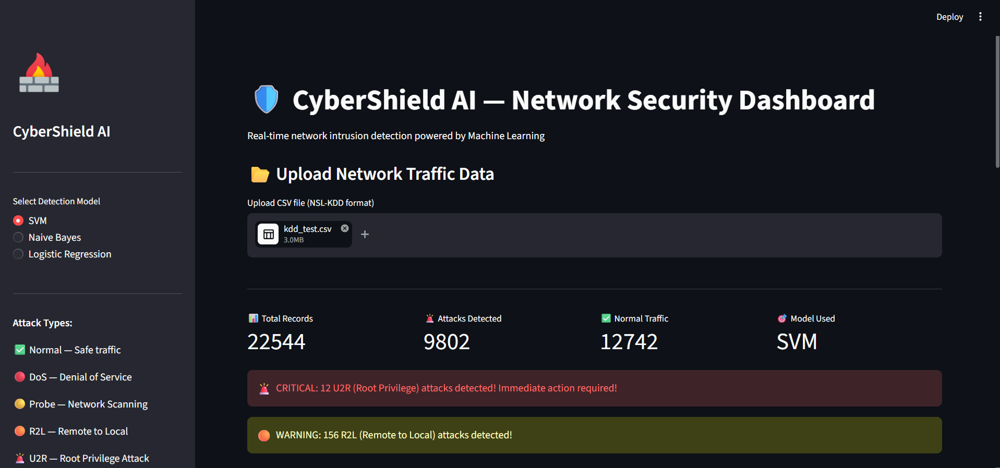
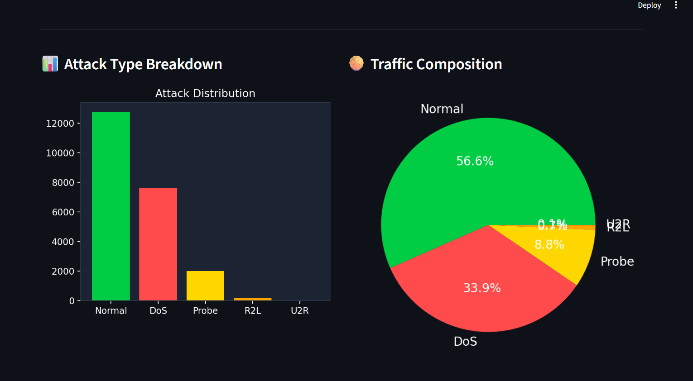
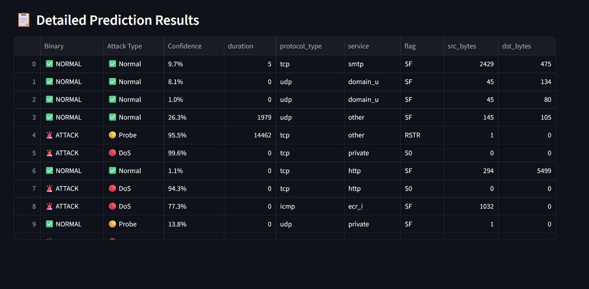

# CyberShield AI - Network Intrusion Detection System

CyberShield AI is a Machine Learning-powered Network Intrusion Detection System (NIDS) built using the NSL-KDD dataset. The system detects and classifies network traffic into five categories: Normal, DoS, Probe, R2L, and U2R attacks through an interactive Streamlit dashboard.

The application supports real-time traffic analysis, attack visualization, alert generation, and model comparison using multiple machine learning algorithms including SVM, Logistic Regression, and Naive Bayes.

---

## Features

- Multi-class Network Attack Classification
- Real-time Network Traffic Analysis
- Detection of Normal and Malicious Traffic
- Attack Classification into:
  - Normal
  - DoS (Denial of Service)
  - Probe
  - R2L (Remote to Local)
  - U2R (User to Root)
- Data Preprocessing using Label Encoding and Standardization
- Dimensionality Reduction using PCA
- Multiple Machine Learning Models:
  - Support Vector Machine (SVM)
  - Logistic Regression
  - Naive Bayes
- Interactive Streamlit Dashboard
- Real-time Alerts for Critical Attacks
- Attack Distribution Visualization
- Detailed Prediction Reports
- Model Persistence using Pickle (.pkl)

---

## Dataset

- NSL-KDD Dataset
- Training Dataset: `kdd_train.csv`
- Testing Dataset: `kdd_test.csv`
- Multi-class Attack Detection Dataset

Attack Categories:

| Class | Description |
|---------|-------------|
| Normal | Legitimate Network Traffic |
| DoS | Denial of Service Attack |
| Probe | Network Scanning Attack |
| R2L | Remote to Local Attack |
| U2R | User to Root Privilege Escalation Attack |

---

## Technologies Used

- Python
- Pandas
- NumPy
- Scikit-learn
- Streamlit
- Matplotlib
- Seaborn
- Joblib / Pickle

---

## Project Workflow

1. Load NSL-KDD Dataset
2. Perform Data Cleaning and Preprocessing
3. Encode Categorical Features using Label Encoding
4. Scale Numerical Features using StandardScaler
5. Apply PCA for Dimensionality Reduction
6. Train Multiple Machine Learning Models
7. Evaluate Model Performance
8. Save Trained Models
9. Deploy Real-Time Dashboard using Streamlit

---

## Results

| Model | Accuracy |
|---------|---------|
| Naive Bayes | 88.01% |
| Logistic Regression | 88.95% |
| SVM | **89.01%** |

**Best Performing Model:** Support Vector Machine (SVM) with 89.01% Accuracy.

---

## Dashboard Preview

### Main Dashboard



### Attack Analysis



### Prediction Results



---

## Repository Structure

```text
Network-Intrusion-Detection-System/
│
├── app.py
├── train.ipynb
├── kdd_train.csv
├── kdd_test.csv
├── le_attack.pkl
├── le_flag.pkl
├── le_protocol.pkl
├── le_service.pkl
├── logistic_regression.pkl
├── naive_bayes.pkl
├── pca.pkl
├── random_forest.pkl
├── scaler.pkl
├── svm.pkl
├── screenshots/
│   ├── dashboard_main.png
│   ├── dashboard_analysis.png
│   └── dashboard_results.png
└── README.md
```

---

## How to Run

### Clone the Repository

```bash
git clone https://github.com/priyadharshini04-k/Network-Intrusion-Detection-System.git
```

### Install Dependencies

```bash
pip install streamlit pandas numpy scikit-learn matplotlib seaborn joblib
```

### Run the Application

```bash
streamlit run app.py
```

### Open in Browser

```text
http://localhost:8501
```

---

## Future Enhancements

- Deep Learning-based Intrusion Detection
- Real-time Packet Capture Integration
- Model Performance Comparison Dashboard
- Cloud Deployment
- Advanced Threat Intelligence Integration

---

## Author

**Priya Dharshini**

B.Tech Computer Science and Engineering  
Cyber Security and Blockchain Technology
